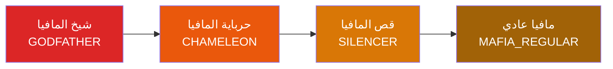

# 🎭 تحليل شامل لمنطق الأدوار والقدرات — Phygital Mafia Engine

> **الهدف**: توثيق كامل لمنطق الشخصيات والقدرات والتفاعلات بينها، ليكون مرجعاً دائماً عند إضافة أي شخصية جديدة.
> **آخر تحديث**: يونيو 2026

---

## 📐 1. البنية المعمارية — محركان متوازيان

المحرك يدعم نمطين للعمل يُختاران عبر `GameConfig.useDynamicEngine`:

### المحرك القديم (Legacy/Fallback)
- منطق مبني بـ `if/else` و `switch` في الكود مباشرة
- ملفات رئيسية:
  - [roles.ts](file:///c:/Projects/new%20mafia/unified-mafia/backend/src/game/roles.ts) — تعريف `Role` enum + خوارزمية `generateRoles()`
  - [night-resolver.ts](file:///c:/Projects/new%20mafia/unified-mafia/backend/src/game/night-resolver.ts) — معالجة تقاطعات الليل
  - [night.socket.ts](file:///c:/Projects/new%20mafia/unified-mafia/backend/src/sockets/night.socket.ts) — طابور الليل وإدارة الخطوات
- يستخدم `NIGHT_QUEUE_ORDER` لترتيب الإجراءات ثابتاً

### المحرك الديناميكي (Data-Driven)
- يقرأ التعريفات من قاعدة البيانات (PostgreSQL) عبر:
  - [definition-service.ts](file:///c:/Projects/new%20mafia/unified-mafia/backend/src/game/definition-service.ts) — Cache + قراءة من DB
  - [dynamic-night-resolver.ts](file:///c:/Projects/new%20mafia/unified-mafia/backend/src/game/dynamic-night-resolver.ts) — بناء الطابور + التسوية
  - [game-config.schema.ts](file:///c:/Projects/new%20mafia/unified-mafia/backend/src/schemas/game-config.schema.ts) — جداول DB
- جداول DB:
  - `ability_definitions` — تعريف القدرات
  - `role_definitions` — تعريف الأدوار + ربطها بقدرات
  - `card_templates` — تصميم البطاقات البصري
  - `interaction_rules` — قواعد التقاطع بين القدرات

> [!IMPORTANT]
> كلا المحركين يجب أن يبقيا متسقين. عند إضافة شخصية جديدة، يجب تحديث **كلا المسارين**.

---

## 🏗️ 2. هيكل الفرق

```
┌──────────────────┐   ┌──────────────────┐   ┌──────────────────┐
│  فريق المافيا     │   │  فريق المواطنين   │   │  فريق محايد       │
├──────────────────┤   ├──────────────────┤   ├──────────────────┤
│ GODFATHER        │   │ SHERIFF          │   │ JESTER           │
│ SILENCER         │   │ DOCTOR           │   │ ASSASSIN         │
│ CHAMELEON        │   │ SNIPER           │   │                  │
│ WITCH            │   │ POLICEWOMAN      │   │                  │
│ OLDER_BROTHER    │   │ NURSE            │   │                  │
│ MAFIA_REGULAR    │   │ CITIZEN          │   │                  │
│                  │   │ YOUNGER_BROTHER* │   │                  │
└──────────────────┘   └──────────────────┘   └──────────────────┘
                       * يتحول إلى MAFIA عند موت أخيه الأكبر
```

**ملف التعريف**: [roles.ts:31-51](file:///c:/Projects/new%20mafia/unified-mafia/backend/src/game/roles.ts#L31-L51)

---

## 🎭 3. تحليل تفصيلي لكل دور

### 🔪 شيخ المافيا — GODFATHER

| الخاصية | القيمة |
|---------|--------|
| **الفريق** | MAFIA |
| **القدرة** | `KILL` (اغتيال) |
| **المرحلة** | NIGHT |
| **الأولوية** | 1 (أول إجراء) |
| **نوع الهدف** | ENEMY (المواطنين فقط) |
| **استثناء النفس** | ✅ |
| **استثناء آخر هدف** | ❌ |
| **نوع التأثير** | `ELIMINATE` |
| **قابل للتخطي** | ❌ |
| **قابل للوراثة** | ✅ |
| **قدرة خاصة** | 💣 القنبلة (اختياري — `bombEnabled`) |

**الوراثة**: عند موت الشيخ، تنتقل قدرة الاغتيال حسب الترتيب:
```
GODFATHER → CHAMELEON → SILENCER → MAFIA_REGULAR
```
**ملف**: [night.socket.ts:53-58](file:///c:/Projects/new%20mafia/unified-mafia/backend/src/sockets/night.socket.ts#L53-L58)

**القنبلة** (`pendingBomb`): عند إقصاء الشيخ بالتصويت النهاري، يمكنه اختيار إقصاء أحد الجالسين بجانبه (أعلى أو أسفل). يُفعّل عبر `bombEnabled` في `GameConfig`.

---

### 🤐 قص المافيا — SILENCER

| الخاصية | القيمة |
|---------|--------|
| **الفريق** | MAFIA |
| **القدرة** | `SILENCE` (إسكات) |
| **المرحلة** | NIGHT |
| **الأولوية** | 3 |
| **نوع الهدف** | ANY (كل الأحياء) |
| **استثناء النفس** | ❌ (يمكنه استهداف فريقه) |
| **نوع التأثير** | `SILENCE` |
| **قابل للتخطي** | ✅ |
| **قابل للوراثة** | ❌ |

**التأثير**: الهدف يصبح `isSilenced = true` ← ممنوع من الكلام في النهار التالي.
**إزالة الإسكات**: يُصفّر في بداية الليل التالي عبر [resetNightActions](file:///c:/Projects/new%20mafia/unified-mafia/backend/src/game/night-resolver.ts#L371-L373).
**الوراثة**: القص يرث قدرة الاغتيال (المركز الثالث في سلسلة الوراثة).

---

### 🦎 حرباية المافيا — CHAMELEON

| الخاصية | القيمة |
|---------|--------|
| **الفريق** | MAFIA |
| **القدرة** | لا قدرة ليلية مستقلة — يرث الاغتيال |
| **قدرة سلبية** | خداع الشريف (DECEPTION) |
| **الوراثة** | المركز الثاني في سلسلة وراثة الاغتيال |

**آلية الخداع**:
- عند تحقيق الشريف مع الحرباية ← النتيجة `'CITIZEN'` (تظهر كمواطن)
- **استثناء**: إذا كانت الحرباية **معطّلة بالساحرة** ← تُكشف كـ `'MAFIA'`
- **ملف**: [night-resolver.ts:148-156](file:///c:/Projects/new%20mafia/unified-mafia/backend/src/game/night-resolver.ts#L148-L156)
- **في المحرك الديناميكي**: [dynamic-night-resolver.ts:344-353](file:///c:/Projects/new%20mafia/unified-mafia/backend/src/game/dynamic-night-resolver.ts#L344-L353)

---

### 🧙‍♀️ الساحرة — WITCH

| الخاصية | القيمة |
|---------|--------|
| **الفريق** | MAFIA |
| **القدرة** | `DISABLE_ABILITY` (تعطيل قدرة) |
| **المرحلة** | NIGHT |
| **الأولوية** | 2 (بعد الاغتيال، قبل الإسكات) |
| **نوع الهدف** | ENEMY (المواطنين والمستقلين فقط) |
| **استثناء النفس** | ✅ |
| **استثناء آخر هدف** | ❌ (لكن لا تكرر نفس الهدف أبداً) |
| **نوع التأثير** | `DISABLE` |
| **قابل للتخطي** | ✅ |

**آلية التعطيل**:
1. الساحرة تختار هدف من المواطنين (ماعدا الشرطية)
2. الهدف يُعطّل لمدة `witchDisableRounds` جولات (الافتراضي 3)
3. `player.disabledUntilRound = currentRound + disableRounds - 1`
4. اللاعب المعطّل **تُلغى كل أفعاله الليلية** تلقائياً
5. الأهداف السابقة تُسجّل في `state.witchPreviousTargets[]` ← لمنع التكرار

**تأثير التعطيل على الأدوار**:

| الدور المعطّل | التأثير |
|--------------|---------|
| الشريف | لا يستطيع التحقيق |
| الطبيب | لا يستطيع الحماية |
| القناص | لا يستطيع القنص |
| الحرباية | تُكشف هويتها الحقيقية (MAFIA) للشريف |
| الممرضة | لا تستطيع الحماية |
| السفّاح | لا يستطيع الاغتيال |

**ملفات التنفيذ**:
- تسجيل التعطيل: [night.socket.ts:850-868](file:///c:/Projects/new%20mafia/unified-mafia/backend/src/sockets/night.socket.ts#L850-L868)
- إلغاء أفعال المعطّلين: [night-resolver.ts:44-64](file:///c:/Projects/new%20mafia/unified-mafia/backend/src/game/night-resolver.ts#L44-L64)
- تصفير التعطيل المنتهي: [night-resolver.ts:374-378](file:///c:/Projects/new%20mafia/unified-mafia/backend/src/game/night-resolver.ts#L374-L378)

---

### 🎭 مافيا عادي — MAFIA_REGULAR

| الخاصية | القيمة |
|---------|--------|
| **الفريق** | MAFIA |
| **القدرة** | لا قدرة ليلية — يرث الاغتيال فقط |
| **الوراثة** | المركز الرابع (الأخير) في سلسلة وراثة الاغتيال |

---

### 👥 الأخ الأكبر — OLDER_BROTHER

| الخاصية | القيمة |
|---------|--------|
| **الفريق** | MAFIA |
| **القدرة الليلية** | `KILL` (يرث الاغتيال ضمن سلسلة الوراثة) |
| **القدرة السلبية** | ارتباط الدم — ينتحر فوراً إذا مات أخوه الأصغر |
| **الوراثة** | يُدرج ضمن سلسلة وراثة الاغتيال (حسب `ASSASSINATION_INHERITANCE`) |
| **استثناء التعطيل** | ✅ القدرة السلبية (الانتحار) **لا تتأثر** بتعطيل الساحرة |
| **قابل للتخطي** | ❌ (القدرة السلبية تلقائية) |

**آلية ارتباط الدم — السيناريو 1 (موت الأخ الأصغر):**
```
1. الأخ الأصغر يموت (بأي طريقة: اغتيال، قنص، تصويت...)
   → processTwinBond() يتحقق: هل الأخ الأكبر حي؟
   → إذا نعم:
     → type = 'SUICIDE'
     → applySuicide(): الأخ الأكبر يموت فوراً
     → يُسجّل في performanceTracking + MorningEvent
   → إذا الأخ الأكبر ميت أيضاً:
     → لا شيء (الرابطة منتهية)
```

**ملاحظات مهمة:**
- الانتحار يحدث **فوراً** ولا يمكن منعه بالحماية
- إذا مات الاثنان في نفس الليلة (مثلاً: المافيا تقتل الأصغر + القناص يقنص الأكبر)، لا يحصل انتحار مزدوج
- الأخ الأكبر يظهر ضمن قائمة `mafiaTeam` كشريك مافيا

**ملفات التنفيذ:**
- محرك التوأمين: [twin-engine.ts](file:///c:/Projects/new%20mafia/unified-mafia/backend/src/game/twin-engine.ts)
- تهيئة الحالة: [twin-engine.ts:38-54](file:///c:/Projects/new%20mafia/unified-mafia/backend/src/game/twin-engine.ts#L38-L54)
- معالجة ارتباط الدم: [twin-engine.ts:60-119](file:///c:/Projects/new%20mafia/unified-mafia/backend/src/game/twin-engine.ts#L60-L119)
- تطبيق الانتحار: [twin-engine.ts:149-175](file:///c:/Projects/new%20mafia/unified-mafia/backend/src/game/twin-engine.ts#L149-L175)

---

### 👥 الأخ الأصغر — YOUNGER_BROTHER

| الخاصية | القيمة |
|---------|--------|
| **الفريق الأولي** | CITIZEN |
| **الفريق بعد التحول** | MAFIA |
| **القدرة الليلية** | ❌ لا قدرة (قبل التحول) — يرث قدرات الدور الجديد (بعد التحول) |
| **القدرة السلبية** | ارتباط الدم — يتحول إلى مافيا فوراً إذا مات أخوه الأكبر |
| **استثناء التعطيل** | ✅ القدرة السلبية (التحول) **لا تتأثر** بتعطيل الساحرة |
| **يظهر كـ** | `'CITIZEN'` للشريف (قبل التحول) |

**آلية ارتباط الدم — السيناريو 2 (موت الأخ الأكبر):**
```
1. الأخ الأكبر يموت (بأي طريقة: اغتيال، قنص، تصويت...)
   → processTwinBond() يتحقق: هل الأخ الأصغر حي؟
   → إذا نعم:
     → type = 'TRANSFORM'
     → applyTransform():

2. خوارزمية وراثة الدور (resolveTransformRole):
   → البحث في أموات المافيا (باستثناء OLDER_BROTHER نفسه)
   → حسب الأولوية: GODFATHER → SILENCER → CHAMELEON → MAFIA_REGULAR
   → إذا وُجد مافيا ميت → يأخذ دوره
   → إذا لم يُوجد (الأخ الأكبر أول مافيا يموت) → MAFIA_REGULAR

3. تطبيق التحول:
   → player.role = newRole (مثلاً: MAFIA_REGULAR)
   → اللاعب ينتقل من فريق المواطنين إلى فريق المافيا
   → يجب تحديث قائمة mafiaTeam لإخطار الشركاء
```

**أمثلة عملية:**

| حالة الأموات عند موت الأخ الأكبر | الدور الموروث |
|-----------------------------------|---------------|
| لا أحد من المافيا مات قبله | `MAFIA_REGULAR` |
| شيخ المافيا مات سابقاً | `GODFATHER` |
| شيخ + قص ماتوا | `GODFATHER` (أعلى أولوية) |
| حرباية ماتت فقط | `CHAMELEON` |

**ملفات التنفيذ:**
- خوارزمية وراثة الدور: [twin-engine.ts:126-143](file:///c:/Projects/new%20mafia/unified-mafia/backend/src/game/twin-engine.ts#L126-L143)
- تطبيق التحول: [twin-engine.ts:178-244](file:///c:/Projects/new%20mafia/unified-mafia/backend/src/game/twin-engine.ts#L178-L244)
- الاستدعاء عند التصويت: [vote-engine.ts](file:///c:/Projects/new%20mafia/unified-mafia/backend/src/game/vote-engine.ts) — `processTwinBond()`
- الاستدعاء عند الليل: [night-resolver.ts](file:///c:/Projects/new%20mafia/unified-mafia/backend/src/game/night-resolver.ts)

> [!IMPORTANT]
> التوأمان يعملان كوحدة واحدة — موت أي منهما يُغيّر مسار اللعبة بالكامل:
> - موت الأصغر = خسارة عضو مافيا إضافي (الأكبر ينتحر)
> - موت الأكبر = كسب عضو مافيا جديد (الأصغر يتحول)

> [!WARNING]
> **فجوة معروفة:** عند تحوّل الأخ الأصغر، قائمة `mafiaTeam` في واجهة اللاعبين **لا تُحدَّث تلقائياً** — الشركاء القدامى لا يرون العضو الجديد حتى إعادة الانضمام.

---

### 🔍 الشريف — SHERIFF


| الخاصية | القيمة |
|---------|--------|
| **الفريق** | CITIZEN |
| **القدرة** | `INVESTIGATE` (تحقيق) |
| **المرحلة** | NIGHT |
| **الأولوية** | 5 |
| **نوع الهدف** | ANY (ماعدا نفسه) |
| **استثناء النفس** | ✅ |
| **نوع التأثير** | `REVEAL_TEAM` |
| **قابل للتخطي** | ❌ |

**نتائج التحقيق**:
| هدف التحقيق | النتيجة |
|-------------|---------|
| أي مافيا (ماعدا الحرباية) | `'MAFIA'` ✅ |
| الحرباية (غير معطّلة) | `'CITIZEN'` ❌ (خداع) |
| الحرباية (معطّلة بالساحرة) | `'MAFIA'` ✅ |
| السفّاح | `'CITIZEN'` ❌ (خداع) |
| أي مواطن | `'CITIZEN'` ✅ |
| المهرج | `'CITIZEN'` ✅ |

---

### 💉 الطبيب — DOCTOR

| الخاصية | القيمة |
|---------|--------|
| **الفريق** | CITIZEN |
| **القدرة** | `PROTECT` (حماية) |
| **المرحلة** | NIGHT |
| **الأولوية** | 7 |
| **نوع الهدف** | ANY |
| **استثناء النفس** | ❌ (يمكنه حماية نفسه) |
| **استثناء آخر هدف** | ✅ (لا يحمي نفس اللاعب ليلتين متتاليتين) |
| **نوع التأثير** | `BLOCK_ELIMINATE` |
| **قابل للتخطي** | ❌ |

**آلية الحماية**:
- إذا الهدف المحمي = هدف اغتيال المافيا ← `ASSASSINATION_BLOCKED` (الهدف ينجو)
- إذا الهدف المحمي ≠ هدف المافيا ← `PROTECTION_FAILED` (الحماية ضاعت)
- الحماية تحمي أيضاً من السفّاح (`ASSASSIN_BLOCKED`)
- **قيد**: `lastProtectedTarget` يُخزّن ويمنع تكرار الحماية

---

### 🎯 القناص — SNIPER

| الخاصية | القيمة |
|---------|--------|
| **الفريق** | CITIZEN |
| **القدرة** | `SNIPE` (قنص) |
| **المرحلة** | NIGHT |
| **الأولوية** | 8 |
| **نوع الهدف** | ANY (ماعدا نفسه) |
| **استثناء النفس** | ✅ |
| **نوع التأثير** | `CONDITIONAL_ELIMINATE` |
| **قابل للتخطي** | ✅ |

**نتائج القنص**:
| هدف القنص | النتيجة |
|-----------|---------|
| مافيا | `SNIPE_MAFIA` — الهدف يموت فقط ✅ |
| محايد (مهرج/سفّاح) | `SNIPE_MAFIA` — الهدف يموت فقط ✅ |
| مواطن | `SNIPE_CITIZEN` — **الاثنين يموتون** (الهدف + القناص) ❌ |

> [!WARNING]
> في Auto Mode: القناص **يتخطى تلقائياً** عند انتهاء الوقت (بدل اختيار عشوائي) لخطورة القنص الخاطئ.

---

### 👮‍♀️ الشرطية — POLICEWOMAN

| الخاصية | القيمة |
|---------|--------|
| **الفريق** | CITIZEN |
| **القدرة** | **سلبية** — تُفعّل بعد موتها |
| **المرحلة** | بعد الموت (passive) |
| **نوع التأثير** | إقصاء لاعب واحد بعد شرط |

**آلية التفعيل** (3 مراحل):

```
1. الشرطية تموت (ليلاً أو نهاراً)
   → state.policewomanState.isTriggered = true
   → threshold = ceil(citizenAlive / 4)

2. كل مرة يموت مواطن بعدها
   → citizenDeathsSinceTrigger++
   → إذا citizenDeathsSinceTrigger >= threshold
     → isReady = true

3. بداية النهار بعد isReady
   → الليدر يختار لاعب لإقصائه
   → الهدف يموت مباشرة
   → isUsed = true (لا تتكرر)
```

**ملف**: [night-resolver.ts:306-344](file:///c:/Projects/new%20mafia/unified-mafia/backend/src/game/night-resolver.ts#L306-L344)

> [!NOTE]
> الساحرة **لا تستطيع** استهداف الشرطية — مستثناة من قائمة أهداف الساحرة.

---

### 🏥 الممرضة — NURSE

| الخاصية | القيمة |
|---------|--------|
| **الفريق** | CITIZEN |
| **القدرة** | `PROTECT` (حماية — بديلة للطبيب) |
| **المرحلة** | NIGHT (فقط بعد موت الطبيب) |
| **نوع التأثير** | `BLOCK_ELIMINATE` |
| **قابل للتخطي** | ❌ |

**شرط التفعيل**:
1. الطبيب يجب أن يكون ميتاً (`doctor.isAlive === false`)
2. الليدر يُفعّل الممرضة (`nurseActivated = true`)
3. بعد التفعيل: تأخذ **نفس خانة الطبيب** في الطابور (`NIGHT_QUEUE_ORDER`)

**في الطابور**: `NURSE` تُعامل كـ `DOCTOR` (`effectiveRole = data.role === Role.NURSE ? Role.DOCTOR : data.role`)

---

### 👤 مواطن صالح — CITIZEN

| الخاصية | القيمة |
|---------|--------|
| **الفريق** | CITIZEN |
| **القدرة** | ❌ لا قدرة |
| **وظيفة** | ملء المقاعد المتبقية |

---

### 🤡 المهرج — JESTER

| الخاصية | القيمة |
|---------|--------|
| **الفريق** | NEUTRAL |
| **القدرة** | ❌ لا قدرة ليلية |
| **شرط الفوز** | `VOTED_OUT` — يفوز إذا أُقصي بتصويت المدينة أو ديل |
| **شرط إضافي** | يجب أن يبقى على قيد الحياة `jesterSurviveRounds` جولات (الافتراضي 2) |
| **يظهر كـ** | `'CITIZEN'` للشريف |

**طرق الفوز**:
- ✅ يُقصى بالتصويت النهاري (`DAY_VOTE`)
- ✅ يُقصى باتفاقية/ديل (`DEAL`)
- ❌ لا يفوز إذا قُتل ليلاً (مافيا/سفّاح/قنّاص)
- ❌ لا يفوز إذا لم يبقَ على قيد الحياة العدد المطلوب من الجولات

**ملف**: [dynamic-win-checker.ts:88-103](file:///c:/Projects/new%20mafia/unified-mafia/backend/src/game/dynamic-win-checker.ts#L88-L103)

> [!CAUTION]
> فوز المهرج يُنهي اللعبة **فوراً** — بغض النظر عن حالة الفرق الأخرى.

---

### 🔪 السفّاح — ASSASSIN

| الخاصية | القيمة |
|---------|--------|
| **الفريق** | NEUTRAL |
| **القدرة** | `ASSASSINATE` (اغتيال مستقل) |
| **المرحلة** | NIGHT |
| **الأولوية** | 10 (آخر إجراء ليلي) |
| **نوع الهدف** | ANY (ماعدا نفسه) |
| **استثناء النفس** | ✅ |
| **نوع التأثير** | `ELIMINATE` |
| **قابل للتخطي** | ✅ |
| **شرط الفوز** | `COMPLETE_CONTRACTS` — إكمال عدد محدد من العقود |

**نظام العقود**:
```
1. عند أول ليلة:
   → initAssassinState() يولّد عقود عشوائية
   → كل عقد = "اقتل لاعب بدور X" (من الأدوار المميزة الحية)
   → عدد العقود = assassinContractCount (الافتراضي 4)

2. أول ليلة:
   → firstNightPassed = false → ممنوع القتل
   → بعد أول ليلة → firstNightPassed = true

3. كل ليلة بعدها:
   → يختار هدف → إذا الهدف يطابق أي عقد غير مكتمل → يُكمَل
   → العقود بدون ترتيب (v2) — أي عقد مطابق يُحسب

4. حماية الطبيب:
   → إذا الطبيب حمى نفس الهدف → ASSASSIN_BLOCKED (الهدف ينجو)

5. تضارب مع المافيا:
   → إذا المافيا قتلت نفس الهدف → الهدف يموت مرة واحدة
   → لكن العقد لا يُحسب للسفّاح

6. إكمال كل العقود:
   → won = true → pendingWinner = 'ASSASSIN'
```

**تجديد العقود** (`regenerateDeadContracts`):
- إذا الدور المطلوب في عقد خرج من اللعبة (بأي طريقة) ← يُستبدل بدور مميز حي آخر
- **ملف**: [assassin-engine.ts:144-216](file:///c:/Projects/new%20mafia/unified-mafia/backend/src/game/assassin-engine.ts#L144-L216)

> [!NOTE]
> السفّاح يظهر كـ `'CITIZEN'` للشريف (خداع مُدمج).
> السفّاح يخسر إذا مات.

---

## ⚡ 4. طابور الليل — Night Queue

### ترتيب التنفيذ الثابت (المحرك القديم)

```
الخانة 0: 🔪 اغتيال المافيا (GODFATHER — مع وراثة)
الخانة 1: 🤐 إسكات المافيا (SILENCER — قابل للتخطي)
الخانة 2: 🧙‍♀️ تعطيل الساحرة (WITCH — قابل للتخطي)
الخانة 3: 🔍 تحقيق الشريف (SHERIFF)
الخانة 4: 💉 حماية الطبيب (DOCTOR — أو الممرضة)
الخانة 5: 🎯 قنص القناص (SNIPER — قابل للتخطي)
الخانة 6: 🔪 اغتيال السفّاح (ASSASSIN — قابل للتخطي)
```

**ملف**: [night.socket.ts:31-38](file:///c:/Projects/new%20mafia/unified-mafia/backend/src/sockets/night.socket.ts#L31-L38)

### ترتيب التنفيذ في المحرك الديناميكي
يُبنى ديناميكياً من `ability_definitions.priority` ← مرتب تصاعدياً.

---

## 🔄 5. مصفوفة التقاطعات الليلية

### التقاطعات الرئيسية (المحرك القديم)

```
┌─────────────────────────────────────────────────────────────────┐
│                    مصفوفة التقاطعات                              │
├──────────────┬──────────────┬───────────────────────────────────┤
│ الإجراء A    │ الإجراء B    │ النتيجة                          │
├──────────────┼──────────────┼───────────────────────────────────┤
│ KILL (مافيا) │ PROTECT      │ إذا نفس الهدف → ASSASSINATION    │
│              │ (طبيب/ممرضة) │   _BLOCKED (الهدف ينجو)          │
│              │              │ إذا هدف مختلف → ASSASSINATION    │
│              │              │   (الهدف يموت) +                 │
│              │              │   PROTECTION_FAILED              │
├──────────────┼──────────────┼───────────────────────────────────┤
│ ASSASSINATE  │ PROTECT      │ إذا نفس الهدف → ASSASSIN_BLOCKED │
│ (سفّاح)      │ (طبيب/ممرضة) │ إذا هدف مختلف → ASSASSIN_KILL   │
├──────────────┼──────────────┼───────────────────────────────────┤
│ KILL (مافيا) │ ASSASSINATE  │ إذا نفس الهدف → الهدف يموت مرة  │
│              │ (سفّاح)      │   واحدة + العقد لا يُحسب         │
├──────────────┼──────────────┼───────────────────────────────────┤
│ SNIPE        │ (أي)         │ مستقل — يُعالج أولاً             │
│ (قناص)       │              │ مافيا/محايد → الهدف يموت         │
│              │              │ مواطن → الاثنان يموتون           │
├──────────────┼──────────────┼───────────────────────────────────┤
│ SILENCE      │ (أي)         │ مستقل — الهدف يُسكت             │
│ (قص)         │              │ (لا يؤثر على باقي الإجراءات)     │
├──────────────┼──────────────┼───────────────────────────────────┤
│ INVESTIGATE  │ CHAMELEON    │ النتيجة: CITIZEN (خداع)          │
│ (شريف)       │ (عادي)       │ الحرباية المعطّلة → MAFIA        │
├──────────────┼──────────────┼───────────────────────────────────┤
│ INVESTIGATE  │ ASSASSIN     │ النتيجة: CITIZEN (خداع)          │
│ (شريف)       │              │                                  │
├──────────────┼──────────────┼───────────────────────────────────┤
│ DISABLE      │ (أي دور)     │ الهدف يُعطّل لعدة جولات         │
│ (ساحرة)      │              │ أفعاله الليلية تُلغى             │
└──────────────┴──────────────┴───────────────────────────────────┘
```

### التقاطعات في المحرك الديناميكي
تُعرّف في جدول `interaction_rules`:
```sql
-- مثال: الحماية تلغي الاغتيال
INSERT INTO interaction_rules (ability_a, ability_b, condition, resolution, result_event, priority)
VALUES ('KILL', 'PROTECT', 'SAME_TARGET', 'B_CANCELS_A', 'ASSASSINATION_BLOCKED', 1);
```

---

## 🎲 6. خوارزمية توزيع الأدوار

### الخوارزمية في `generateRoles()` — المحرك القديم

```
المدخل: playerCount (عدد اللاعبين، الحد الأدنى 6)

1. حساب عدد المافيا:
   totalMafia = ceil(playerCount / 4)

2. حساب عدد المواطنين:
   totalCitizens = playerCount - totalMafia

3. ملء أدوار المافيا بالترتيب:
   GODFATHER → SILENCER → CHAMELEON → MAFIA_REGULAR (تكرار)

4. ملء أدوار المواطنين بالترتيب:
   SHERIFF → DOCTOR → SNIPER → POLICEWOMAN → NURSE → CITIZEN (تكرار)
```

**ملف**: [roles.ts:102-137](file:///c:/Projects/new%20mafia/unified-mafia/backend/src/game/roles.ts#L102-L137)

### الخوارزمية في الواجهة الأمامية (LeaderRoleConfigurator)

```
1. نفس الحساب الأساسي (ceil(playerCount/4))

2. إضافات ذكية:
   - إذا 8+ لاعبين → يُضاف المهرج تلقائياً (يأخذ مقعد مواطن)
   - الساحرة (WITCH) مُضافة في ترتيب المافيا (المركز الرابع)

3. تبديلات يدوية:
   - الليدر يمكنه تبديل المهرج ↔ مواطن
   - الليدر يمكنه تبديل السفّاح ↔ مواطن
   - الليدر يمكنه تغيير أي دور عبر القائمة المنسدلة
```

**ملف**: [LeaderRoleConfigurator.tsx:21-50](file:///c:/Projects/new%20mafia/unified-mafia/frontend/src/app/leader/LeaderRoleConfigurator.tsx#L21-L50)

> [!WARNING]
> **ملاحظة مهمة**: خوارزمية `generateRoles()` في `roles.ts` **لا تتضمن الساحرة ولا المهرج ولا السفّاح** — يتم إضافتهم فقط في الواجهة الأمامية (`LeaderRoleConfigurator`). هذا يعني أن `generateRoles()` تُستخدم كـ fallback فقط.

### جدول توزيع الأدوار حسب عدد اللاعبين

| اللاعبين | المافيا | المواطنين | المهرج | المافيا المولّدة |
|----------|---------|-----------|--------|-----------------|
| 6 | 2 | 4 | ❌ | شيخ، قص |
| 7 | 2 | 5 | ❌ | شيخ، قص |
| 8 | 2 | 5 | ✅ | شيخ، قص |
| 9 | 3 | 5 | ✅ | شيخ، قص، حرباية |
| 10 | 3 | 6 | ✅ | شيخ، قص، حرباية |
| 12 | 3 | 8 | ✅ | شيخ، قص، حرباية |
| 13 | 4 | 8 | ✅ | شيخ، قص، حرباية، ساحرة |
| 16 | 4 | 11 | ✅ | شيخ، قص، حرباية، ساحرة |
| 17 | 5 | 11 | ✅ | شيخ، قص، حرباية، ساحرة، عادي |
| 20 | 5 | 14 | ✅ | شيخ، قص، حرباية، ساحرة، عادي |

---

## 🏆 7. شروط الفوز

| الفريق | شرط الفوز | الأولوية |
|--------|-----------|---------|
| **السفّاح** | `completedCount >= totalRequired` (إكمال كل العقود) | 1 (أعلى) |
| **المهرج** | إقصاء بتصويت/ديل + بقاء ≥ N جولات | 2 |
| **المافيا** | `aliveMafia >= aliveCitizens` | 3 |
| **المواطنين** | `aliveMafia === 0` | 3 |

**ملفات**:
- [win-checker.ts](file:///c:/Projects/new%20mafia/unified-mafia/backend/src/game/win-checker.ts) — المحرك القديم
- [dynamic-win-checker.ts](file:///c:/Projects/new%20mafia/unified-mafia/backend/src/game/dynamic-win-checker.ts) — المحرك الديناميكي

> [!IMPORTANT]
> المحايدون (NEUTRAL) **لا يُحسبون** لأي فريق في معادلة الفوز:
> - لا يُحسبون ضمن `aliveMafia` ولا `aliveCitizens`
> - فوز المهرج أو السفّاح ينهي اللعبة فوراً بغض النظر عن التوازن

---

## 🔀 8. وراثة الاغتيال — Assassination Inheritance



**كيف تعمل الوراثة**:
```typescript
// في getNextQueueStep — night.socket.ts:1940-1945
for (const inheritRole of ASSASSINATION_INHERITANCE) {
  performer = state.players.find(p => p.role === inheritRole && p.isAlive);
  if (performer) break;
}
```

**الترتيب**: `GODFATHER → CHAMELEON → SILENCER → MAFIA_REGULAR`

يعني: إذا مات الشيخ، الحرباية تنفذ الاغتيال. إذا ماتت الحرباية أيضاً، القص ينفذ. وهكذا.

---

## ⚙️ 9. إعدادات اللعبة المتعلقة بالأدوار (GameConfig)

| الإعداد | النوع | الافتراضي | الوصف |
|---------|-------|-----------|-------|
| `bombEnabled` | boolean | true | 💣 قدرة القنبلة لشيخ المافيا |
| `assassinContractCount` | number | 4 | 🔪 عدد عقود السفّاح (2-6) |
| `jesterSurviveRounds` | number | 2 | 🤡 جولات نجاة المهرج |
| `witchDisableRounds` | number | 3 | 🧙‍♀️ جولات تعطيل الساحرة |
| `maxConsecutiveMafiaGames` | number | 3 | ♟️ الحد الأقصى لتكرار المافيا المتتالية |
| `nightMode` | string | 'manual' | نمط الليل — manual/auto |
| `useDynamicEngine` | boolean | false | 🧩 استخدام المحرك الديناميكي |
| `maxPenalties` | number | 3 | أقصى عقوبات |

**ملف**: [state.ts:173-191](file:///c:/Projects/new%20mafia/unified-mafia/backend/src/game/state.ts#L173-L191)

---

## 📊 10. حالة اللاعب أثناء اللعب (Player Interface)

```typescript
interface Player {
  physicalId: number;        // رقم المقعد
  name: string;              // اسم اللاعب
  role: Role | null;         // الدور (null قبل التوزيع)
  isAlive: boolean;          // هل حي
  isSilenced: boolean;       // هل مسكّت (يُصفّر بداية كل ليل)
  disabledUntilRound?: number;  // 🧙‍♀️ معطّل حتى هذا الراوند
  disabledRoleName?: string;    // 🧙‍♀️ اسم الدور المعطّل (للعرض)
  penalties?: number;        // عدد العقوبات
  // ... حقول أخرى
}
```

---

## 📋 11. دليل إضافة شخصية جديدة — خطوة بخطوة

### الخطوة 1: تعريف الدور في الكود

1. **إضافة قيمة في `Role` enum**:
   - Backend: [roles.ts:8-27](file:///c:/Projects/new%20mafia/unified-mafia/backend/src/game/roles.ts#L8-L27)
   - Frontend: [constants.ts:7-21](file:///c:/Projects/new%20mafia/unified-mafia/frontend/src/lib/constants.ts#L7-L21)

2. **تصنيف الفريق**:
   - `MAFIA_ROLES[]` أو `CITIZEN_ROLES[]` أو `NEUTRAL_ROLES[]` في [roles.ts:31-51](file:///c:/Projects/new%20mafia/unified-mafia/backend/src/game/roles.ts#L31-L51)
   - نفس الشيء في [constants.ts:23-24](file:///c:/Projects/new%20mafia/unified-mafia/frontend/src/lib/constants.ts#L23-L24)

3. **اسم بالعربي**:
   - `ROLE_NAMES_AR` في [roles.ts:77-91](file:///c:/Projects/new%20mafia/unified-mafia/backend/src/game/roles.ts#L77-L91)
   - `ROLE_NAMES` في [constants.ts:34-48](file:///c:/Projects/new%20mafia/unified-mafia/frontend/src/lib/constants.ts#L34-L48)
   - `ROLE_NAMES_AR` في [state.ts:136-147](file:///c:/Projects/new%20mafia/unified-mafia/backend/src/game/state.ts#L136-L147) (للسفّاح)

4. **أيقونة**:
   - `ROLE_ICONS` في [constants.ts:50-64](file:///c:/Projects/new%20mafia/unified-mafia/frontend/src/lib/constants.ts#L50-L64)

### الخطوة 2: تعريف القدرة

1. **هل الدور له قدرة ليلية؟**
   - إذا نعم ← إضافته في `NIGHT_ACTIVE_ROLES` في [roles.ts:54-61](file:///c:/Projects/new%20mafia/unified-mafia/backend/src/game/roles.ts#L54-L61)

2. **تعريف حقل `NightActions`** (إذا يحتاج):
   - إضافة حقل جديد في [state.ts:106-118](file:///c:/Projects/new%20mafia/unified-mafia/backend/src/game/state.ts#L106-L118)

3. **نوع حدث الصباح** (إذا يحتاج):
   - إضافة نوع جديد في `MorningEvent.type` في [state.ts:121](file:///c:/Projects/new%20mafia/unified-mafia/backend/src/game/state.ts#L121)

### الخطوة 3: منطق الطابور الليلي

1. **إضافة في `NIGHT_QUEUE_ORDER`**: [night.socket.ts:31-38](file:///c:/Projects/new%20mafia/unified-mafia/backend/src/sockets/night.socket.ts#L31-L38)
2. **اسم الإجراء**: `ACTION_NAMES` في [night.socket.ts:42-50](file:///c:/Projects/new%20mafia/unified-mafia/backend/src/sockets/night.socket.ts#L42-L50)
3. **سلسلة الوراثة** (إذا مافيا): [night.socket.ts:53-58](file:///c:/Projects/new%20mafia/unified-mafia/backend/src/sockets/night.socket.ts#L53-L58)
4. **قابل للتخطي** (`canSkip`): [night.socket.ts:1996](file:///c:/Projects/new%20mafia/unified-mafia/backend/src/sockets/night.socket.ts#L1996)

### الخطوة 4: منطق التقاطعات

1. **`night:submit-action`**: إضافة case في switch في [night.socket.ts:792-880](file:///c:/Projects/new%20mafia/unified-mafia/backend/src/sockets/night.socket.ts#L792-L880)
2. **`resolveNight()`**: إضافة منطق التقاطع في [night-resolver.ts:33-301](file:///c:/Projects/new%20mafia/unified-mafia/backend/src/game/night-resolver.ts#L33-L301)
3. **`getAvailableTargets()`**: إضافة case في [night-resolver.ts:395-455](file:///c:/Projects/new%20mafia/unified-mafia/backend/src/game/night-resolver.ts#L395-L455)

### الخطوة 5: المحرك الديناميكي (DB)

1. **SQL Migration**: إضافة قدرة في `ability_definitions`
2. **SQL Migration**: إضافة دور في `role_definitions`
3. **SQL Migration**: إضافة بطاقة في `card_templates`
4. **SQL Migration**: إضافة قواعد تفاعل في `interaction_rules`
5. إذا `effectType` جديد ← إضافته في `effectTypeEnum` في [game-config.schema.ts:18-21](file:///c:/Projects/new%20mafia/unified-mafia/backend/src/schemas/game-config.schema.ts#L18-L21)
6. إضافة معالجة التأثير في [dynamic-night-resolver.ts:273-395](file:///c:/Projects/new%20mafia/unified-mafia/backend/src/game/dynamic-night-resolver.ts#L273-L395)

### الخطوة 6: Auto Mode

1. **`getAutoActionType()`**: [night.socket.ts:64-77](file:///c:/Projects/new%20mafia/unified-mafia/backend/src/sockets/night.socket.ts#L64-L77)
2. **`getAutoTargets()`**: [night.socket.ts:80-104](file:///c:/Projects/new%20mafia/unified-mafia/backend/src/sockets/night.socket.ts#L80-L104)
3. **اختيار عشوائي عند timeout**: [night.socket.ts:299-368](file:///c:/Projects/new%20mafia/unified-mafia/backend/src/sockets/night.socket.ts#L299-L368)
4. **`player:night-action` (Auto)**: [night.socket.ts:1640-1678](file:///c:/Projects/new%20mafia/unified-mafia/backend/src/sockets/night.socket.ts#L1640-L1678)
5. **`night:auto-approve-step`**: [night.socket.ts:1786-1824](file:///c:/Projects/new%20mafia/unified-mafia/backend/src/sockets/night.socket.ts#L1786-L1824)

### الخطوة 7: الواجهة الأمامية

1. **`LeaderRoleConfigurator.tsx`**: إضافة زر toggle وإعدادات
2. **بطاقة اللاعب**: تصميم البطاقة الخاصة بالدور الجديد
3. **أنيميشن الليل**: إضافة نوع أنيميشن جديد
4. **ملخص الصباح**: إضافة عرض الحدث الجديد

### الخطوة 8: إعدادات اللعبة (إذا لزم)

1. إضافة إعداد في `GameConfig` في [state.ts:173-191](file:///c:/Projects/new%20mafia/unified-mafia/backend/src/game/state.ts#L173-L191)
2. إضافة واجهة التحكم في `LeaderRoleConfigurator`

### الخطوة 9: التنظيف عند إعادة التشغيل

1. تصفير حالة الدور الجديد في `game:restart` في [night.socket.ts:1527-1583](file:///c:/Projects/new%20mafia/unified-mafia/backend/src/sockets/night.socket.ts#L1527-L1583)

### الخطوة 10: الاختبار

1. فحص أن الدور يظهر في التوزيع
2. فحص القدرة الليلية (Manual + Auto)
3. فحص التقاطعات مع كل دور آخر
4. فحص شرط الفوز (إذا محايد)
5. فحص التعطيل بالساحرة
6. فحص إعادة التشغيل والتنظيف

---

## 🗃️ 12. ملخص الملفات المتأثرة عند إضافة شخصية

| الملف | السبب |
|-------|-------|
| `backend/src/game/roles.ts` | تعريف Role enum + التصنيف |
| `backend/src/game/state.ts` | Player interface + NightActions + GameConfig |
| `backend/src/game/night-resolver.ts` | تقاطعات + أهداف + تصفير |
| `backend/src/game/dynamic-night-resolver.ts` | معالجة effectType جديد |
| `backend/src/sockets/night.socket.ts` | طابور + submit + skip + Auto |
| `backend/src/game/win-checker.ts` | شروط فوز (إذا لزم) |
| `backend/src/game/dynamic-win-checker.ts` | شروط فوز ديناميكية |
| `backend/src/schemas/game-config.schema.ts` | إذا effectType أو enum جديد |
| `frontend/src/lib/constants.ts` | Role enum + أسماء + أيقونات |
| `frontend/src/app/leader/LeaderRoleConfigurator.tsx` | توزيع + toggle + إعدادات |
| `migrate_[role].sql` | DB migration للمحرك الديناميكي |
